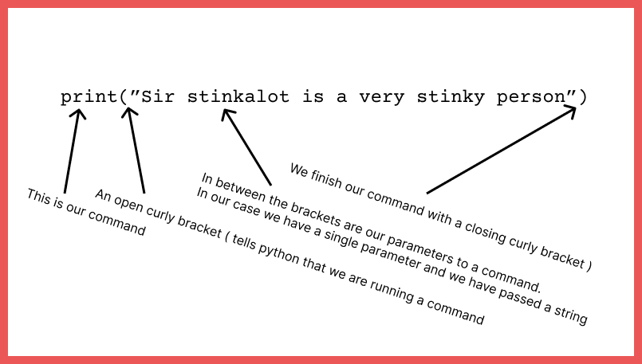

Well done Alban - in the last lesson you successfully did two things:
1. Called out that Jonny is a stinkalot
2. Wrote a statement

# Statements
If we go with a program being like recipe, then a statement is like an instruction in your recipe. It tells your computer what you want it to do.

If we look at the [documentation for print](https://docs.python.org/3/library/functions.html#print) then you will find out that blah blah blah blah blah. Yep, documentation is boring and not always that helpful. Nowhere does it mention about print being use to tell people they are Sir Stinkalot. Pah.

A statement is (usually) a verb followed by an open bracket, followed by a list of parameters, followed by a close bracket.

Notes:
- A string is not made out of string. It is made out of characters.
- A character is not someone who does something funny as in, Sir Stinkalot, what a character. It is a either a letter, a number zero to nine or one of the other strange things found on your keyboard (and some that aren't!)
- Python knows it is a string because you have put a double quote " at the beginning and the end.

# Loops
All good, what if you wanted to say sir stinkalot was stinky, but lots of times.

Well you could just use more statements. Each statement goes on a new line. 

~~~python
    print("Sir stinkalot is very stinky")
    print("Sir stinkalot is very stinky")
~~~

And repeat for the number of times you want to print it out. This would be the right and proper way but who likes right and proper? Much better to cheat.

Cheating is fun, and what computers are made for. The way to cheat is a loop. In a loop you can repeat yourself. In a loop you can repeat yourself. In a loop you can repeat yourself. You get the idea.

## What to do

What I want you to do is print out "Sir stinkalot is very stinky" 100 hundred times.

I'm not going to tell you how, but I will give you a hint. Then next time we'll break it down and work out what is going on.

Google some help on this one, but you will need the "for" keyword and a "range" command.

When you are done - email me your code - jonnypmuir@gmail.com