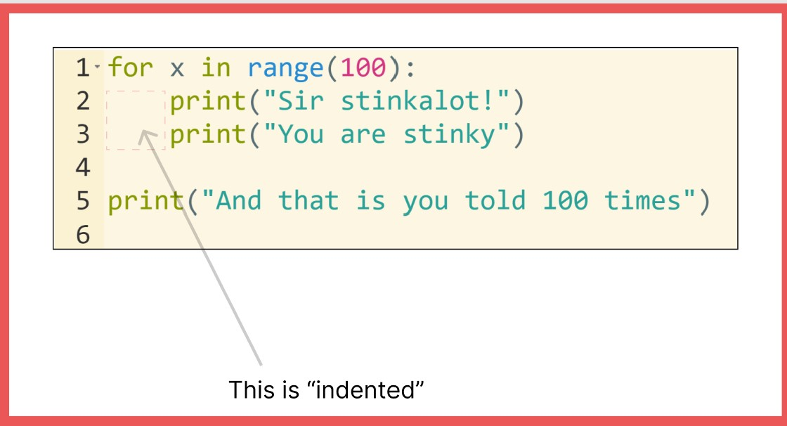

Well done Alban - in the last lesson you successfully did:
1. Reinforced the stinkyness of Jonny
2. Looked at repeating stuff

# Statements and flow

We learned that you can do multiple statements on separate lines, like a recipe.

But we can also do something a bit more funky, we can change the flow of how the statements run. 

So what is going on?

__for__ tells python that we want to do a [forloop](https://wiki.python.org/moin/ForLoop)

__range(100)__ defines a collection of things that we want to loop round. In our case, all number whole numbers from 0 to 99 (i.e. a 100 actual numbers)

__x__ is what we call a variable. More on these later. Feel free to have a play around and see if there is anything you can use this for.

And then something weird happens. [Python cares about code being readable](https://peps.python.org/pep-0020/#the-zen-of-python). Just like human languages, computer languages are typically different levels of pure gibberish, until you learn them and become accustomed to their gibberishness.

Python can still be a bit gibberish, but a nice level of gibberish. One of the ways it scales down the gibberish is what is by using what is known as "indenting" - the numbers of spaces you put before a command, in a readable way.

We can see how this works in the example above. See lines 1 and 5? They have no spaces before them. These are top level.

See lines 2 and 3. These have some spaces (4 in our case) before the print command. This tells python that these two lines are best of friends and are grouped together. They also belong to our __for__ loop.

Line 5 however is not bestie with lines 2 or 3 and does not belong to the __for__ loop. It will run afterwards and just do its own thing.

Put it into the code editor below and have a play around with. Mess with the spaces and see what it does. If you get error messages take your time to read them. Error messages typically are gobblydegook, but it is worth just spending time unpacking exactly what they say because they often are trying to tell you something. My advice is usually just concentrate on the first error message.

## Notes:

## What to do

Just write out the code in the screen shot into the code editor and have a little mess with it. 

Try and understand how the indentation works by breaking it. For instance what happens if you use 3 spaces, not 4 on line 2? What happens if you use 3 spaces on line 2 and 3? What happens if you start using spaces on 5? Can you get it to be friends with line 2 and 3? Just mess and enjoy, and when you are bored - do something else. I'll catch-up with you soon and we will start to design out a game.