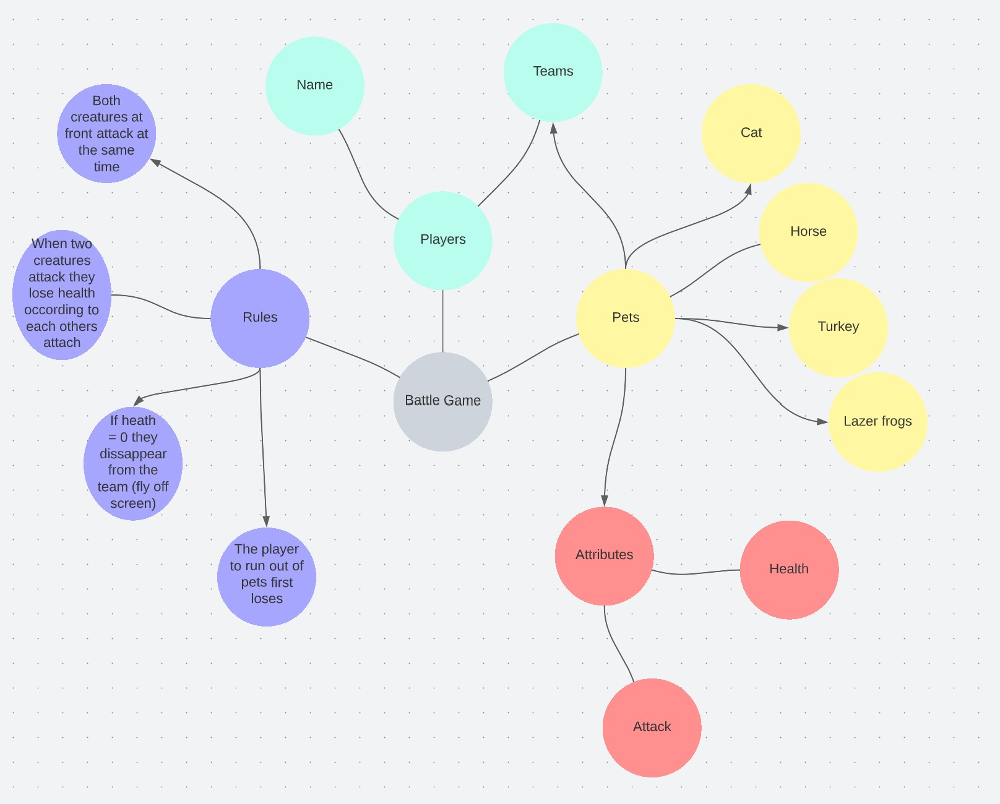

Well done - in the last lesson you learnt:
1. You can assign values to variables
2. Variables are probably useful, but we aren't sure why yet. You'll find out soon that you'll need them all over the place to help you solve problems
3. Variables have names

This time round we are going to ramp it up a little bit and talk about classes. Once you get these under your belt you are away.

Until now you've been whacking code into the code window and this is fun, but if we want stuff to be useful and start making games we need to start getting serious and organising stuff. To do this we use something called a "class".

A class is something we code to describe something. When we want to make an actual thing we can create an instance of something by saying "here is my classification of what I want - now magic it from thin air".

That's right, by writing computer programs we become wizards. We create things where things were not originally. Let's try our apple example again, but this time with classes.

## Without classes
_Me_: I want 5 apples please.

_Shopkeeper_: Sure here you go.

## With classes
_Me_: I hereby declare a classification of things called "fruit". A fruit can be of a type called apple, orange or a hearty durian. It has a colour, weight, cost and I can eat it, throw it in the air, buy it or sell it. 

_Me_: Hey, computer wizard thing - create me 5 fruit and make them apples please.

_Python_: There you go 5 apples for you.

_Shopkeeper_: Hey - where did you get them from?

Shopkeepers do not like wizards just creating fruit out of nothing.

## Defining a class
A class is defined by using the word, wait for it, class.

Then a name you want to give it. It is worth trying to give the class a name that is meaningful, because you are going to need to remember it.

Working out what classes you need and how to use them is the cool thing about programming. This is called "design" in the boring grown up real world. In our imaginary world of programming it is called being a supreme creator.

We'll take a quick look a the mind map we made and just pick something interesting now to give us enough to start playing around with classes and objects.

So for me there is one particular thing in the mind map that stands out. I'm of course going for a laser frog.

Let's create a class to represent laser frogs

Here is the boring [blah blah blah about classes](https://docs.python.org/3/tutorial/classes.html) in the documentation. 

We'll just dive in.

~~~python
class LaserFrog:
~~~

And we can then define things a LaserFrog does using "def"

~~~python
class LaserFrog:
  def Battle(self):
    print("The laser frog fires a laser at its opponent")
~~~

We can also have "attributes" - things that belong to a LaserFrog. We are going to create a "laser charge" as an attribute. To set an attribute we tell the class what we want to initialise it to. 

Here we introduce you to another thing about programming - Gobblydegook you just have to learn. But don't worry, you'll best learn it by just looking at what other people do and by usually getting it wrong. This is not only ok, it is very normal.

We can see some gobblydegook at play below. In every method the word "self" is always the first parameter. You use it to refer to the "instance" of the thing (in our case an instance of a LaserFrog).

The second bit of gobblydegook is the method name \_\_init\_\_. This is a special method that will be called once and only once when you create an instance of your class (which we don't know how to do yet, but bear with us, not that we have coded bears yet).

~~~python
class LaserFrog:
  def __init__(self):
        self.LaserCharge = 10
       
  def Battle(self):
    print("The laser frog fires a laser at its opponent")
~~~

Ok. Above I've decided that an attribute of a LaserFrog is to have some LaserCharge, let's do some more interesting things with it though. Every time we fire a laser, let's reduce it. If we run out of laser - sad face.

Note here we are also using ["if" statements](https://docs.python.org/3/tutorial/controlflow.html)

~~~python
class LaserFrog:
  def __init__(self):
        self.LaserCharge = 10
       
  def Battle(self):
    if(self.LaserCharge > 0):
      print("The laser frog fires a laser at its opponent")
      self.LaserCharge = self.LaserCharge - 1
    else:
      print("No laser charge left. Sad face :(")
~~~

And to bring it all together we need to also create some instances of our brand new shiny "class". Until now we have only defined what a LaserFrog is. Let's create some. To create an instance of class simply give it a name and say it is LaserFrog like this. Note more gobblydegook in the () bit. Why do you need these - because we are a creating a LaserFrog and creating is a special method.

~~~python
Albert = LaserFrog()
~~~

Let's bring it altogether then I suggest you have a play around with it too.

Note we have also started using [comments](https://docs.python.org/3/reference/lexical_analysis.html#comments). These help our future selves work out what on earth our past selves were thinking.

Also note I've passed more parameters into the init so I can use it in my messages.

I've also had a bit of fun with the battling so we can pit one frog against another. So you will see I've passed one frog into the battle function so a frog can battle another frog.

And finally I've created a game loop so we can battle the frogs. TO THE DEATH!

~~~python
# We need to import some random functionality - imports give us access to other things than what python gives us out of the box
import random

# Here we create a definition of what a LaserFrog is
class LaserFrog:
  def __init__(self, name):
    self.LaserCharge = 10
    self.Name = name
    self.Health = 10
       
  def Battle(self, other):
    # We can only do battle if we are alive
    if(self.Health <= 0):
      print(self.Name + " is not alive, what do you think you are doing?")
    elif(self.LaserCharge > 0):
      # I we have enough charge - fire a laser
      print(self.Name + " fires a laser at " + other.Name)
      self.LaserCharge = self.LaserCharge - 1

      # Decide how much health to reduce - note random.randrange only works here because we imported random above
      attackPower = random.randrange(10)
      other.Health = other.Health - attackPower

      # Did we finish the other one off?
      if(other.Health <= 0):
        print(other.Name + " croaks it")
      else:
        print(other.Name + " took damage, but survives with a health of "+str(other.Health))
    else:
      print(self.Name + " has no laser charge left. Sad face :(")

# Next we are going to create a couple of LaserFrogs and make them battle a little bit.
# Note the indentation here - we are outside of the class definition now
Albert = LaserFrog("Albert")
Gertrude = LaserFrog("Gertrude")

# Now we are going to go into a game loop and battle one against the other until one or the other loses
# Loop while both Albert and Gertrude have health
while Albert.Health > 0 and Gertrude.Health > 0:
  print("Frogs - prepare for battle!")
  # Gertrude goes first - is this fair? Maybe we want to switch this around at some point
  Gertrude.Battle(Albert)
  Albert.Battle(Gertrude)
  print()

print("Game over")
if(Albert.Health > 0):
  print("Albert won")
else:
  print("Gertrude won")

~~~
## What to do

Just copy any of the bits of code and start messing around. See what they do.

Next time we'll look at how we might put it all together into a more interesting game and mix it up a little.